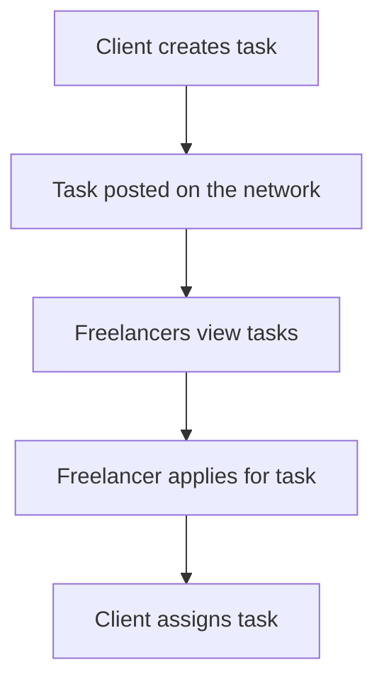
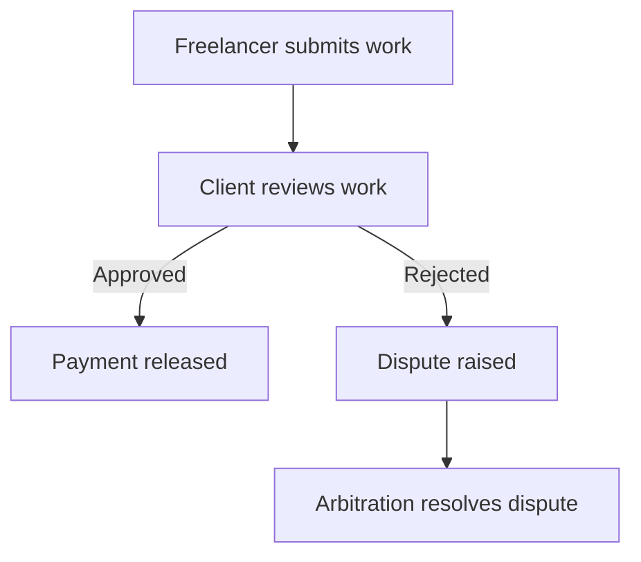
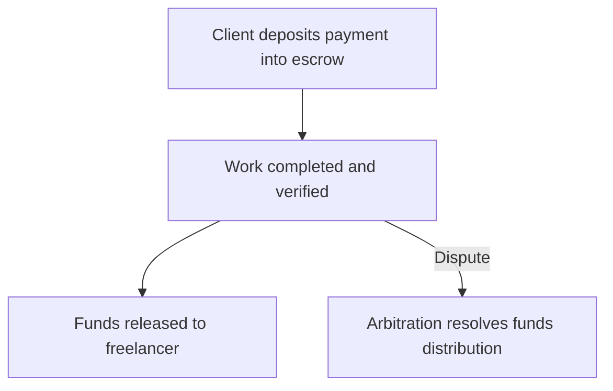

# Decentralized Freelance Marketplace on Post Fiat Network

## Overview
This document provides the technical specification for a decentralized freelance marketplace built on the Post Fiat network. The platform aims to connect freelancers and clients in a trustless and decentralized manner.

---

## Components

### 1. Task Creation
Clients can create tasks by specifying requirements, deadlines, and payment terms.

- **Fields:**
  - Task ID
  - Task Title
  - Task Description
  - Payment Amount (in Post Fiat tokens)
  - Deadline (Timestamp)
  - Required Skills
  - Client Wallet Address

- **Task Lifecycle:**
  - `Created` → `Assigned` → `In Progress` → `Completed` → `Closed`

---

### 2. Verification Flow
Freelancer submits work, and the client reviews it. If approved, payment is released.

- **Actions:**
  - Freelancer uploads deliverables.
  - Client verifies deliverables.
  - Dispute resolution is handled via arbitration if needed.

---

### 3. Payment Flow
Smart contracts handle escrow and payment release.

- **Steps:**
  1. Client deposits payment into a task-specific escrow contract.
  2. Upon completion, client approves payment release.
  3. If a dispute arises, arbitration resolves the payment distribution.

---

### 4. Reputation System
A decentralized reputation system tracks performance metrics for freelancers and clients.

- **Metrics:**
  - Task completion rate
  - Timeliness
  - Ratings (1-5 stars)
  - Review comments

---

## Flow Diagrams

### Task Creation Flow

### Verification Flow

### Payment Flow

---

## Smart Contract Specifications

### Task Management Contract

#### Functions:
- `createTask(taskDetails)`: Creates a new task.
- `applyForTask(taskID, freelancerAddress)`: Freelancer applies for a task.
- `assignTask(taskID, freelancerAddress)`: Assigns task to a freelancer.
- `submitWork(taskID, workHash)`: Freelancer submits work.
- `verifyWork(taskID, isApproved)`: Client verifies submitted work.
- `raiseDispute(taskID)`: Raises a dispute.

### Payment Escrow Contract

#### Functions:
- `deposit(taskID, amount)`: Deposits payment into escrow.
- `releasePayment(taskID)`: Releases payment to the freelancer.
- `resolveDispute(taskID, distribution)`: Resolves disputes and distributes funds.

### Reputation Management Contract

#### Functions:
- `updateReputation(userID, rating, role)`: Updates reputation metrics.
- `getReputation(userID)`: Retrieves reputation data.

---

## Reputation System Design

### Structure:
- **On-chain Storage:**
  - User ID → Reputation Metrics
- **Weightage:**
  - Task completion rate: 40%
  - Timeliness: 30%
  - Ratings: 30%

---

## Deployment Details
- **Network:** Post Fiat Mainnet
- **Language:** Solidity
- **Frameworks:** Hardhat, Truffle
- **Testing Tools:** Mocha, Chai
- **Deployment Tools:** Post Fiat CLI, IPFS for file storage

---

## Future Improvements
- Decentralized arbitration pools.
- AI-based task recommendation engine.
- Cross-chain interoperability for multi-token payments.

---
